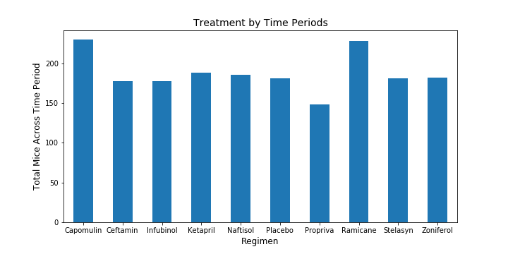
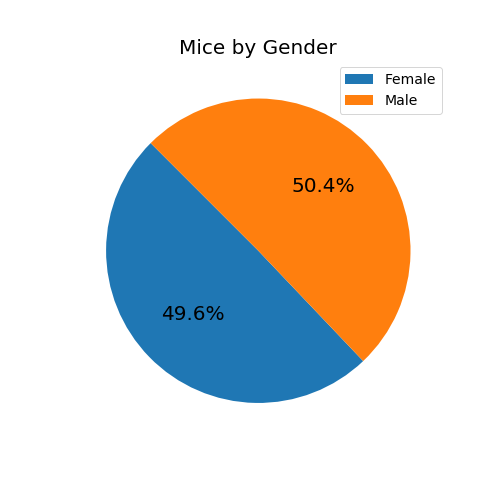
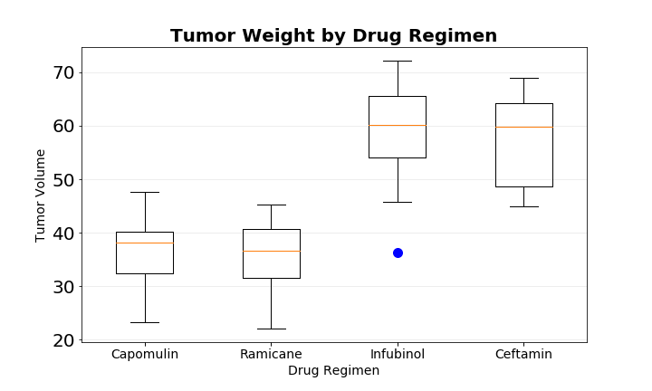
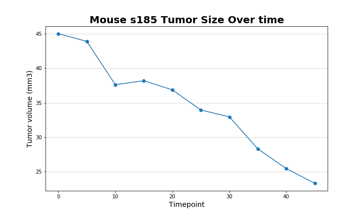
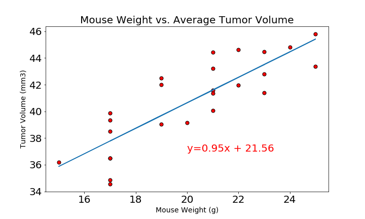

# Pymacueticals: Analysis of Cancer Drug Treatment in Mice

In this study, 249 mice identified with SCC tumor growth were treated through a variety of drug regimens. Over the course of 45 days, tumor development was observed and measured. The purpose of this study was to compare the performance of Pymaceuticals' drug of interest, Capomulin, versus the other treatment regimens. You have been tasked by the executive team to generate all of the tables and figures needed for the technical report of the study. The executive team also has asked for a top-level summary of the study results.

### Analysis

1. Comparing all 9 drug treatments as well as a placebo, the long-term survival rate was the highest in those treated with Capomulin and Ramicane Out of 250 possible time points for each of these drugs, Capomulin recorded 230 by the end of the study, closely followed by Ramicane with 228.

2. In order to account for any possible variation in the data based on gender, an almost identical number of male and female mice were included.

3. Looking at the final tumor weight of the most promising treatment regimens: Capomulin, Ramicane, Infubinol, and Ceftamin, both Capomulin and Ramican had similar ending average tumor weights by volume and outperformed Infubinol and Ceftamin in comparison. Infubinol was the only treatment to have an outlier. 

4. Looking specifically at one mouse in the Capomulin study, the average tumor size reduced consistenly over time from a high of 45 at the start of the study, to a low of 23.34 at the end of the study.

5. There is a strong correlation between the average tumor volume and mouse weight. This means that mouse weight should be taken into consideration when determining the efficacy of the drug.

**Conclusion**

Capomulin appears to be an effective treatment in reducing the tumor size in mice and outperformed the other drugs tested. As a point of interest, Ramicane appeared to be almost as effective as Capomulin during the 45-day trial. Both of these drugs would need further testing to determine if there is a significant difference over a longer time frame in both tumor size reduction and survivability.

------------------------------------
**Instructions:**

Analyze the sample mouse data and perform the following tasks:

* Clean the data and look for any duplicates to remove

* Generate a summary statistics table consisting of the mean, median, variance, standard deviation, and SEM of the tumor volume for each drug regimen.

* Generate a bar plot using both Pandas's DataFrame.plot() and Matplotlib's pyplot that shows the number of total mice for each treatment regimen throughout the course of the study.

* Generate a pie plot using both Pandas's DataFrame.plot() and Matplotlib's pyplot that shows the distribution of female or male mice in the study.

* Calculate the final tumor volume of each mouse across four of the most promising treatment regimens: Capomulin, Ramicane, Infubinol, and Ceftamin. Calculate the quartiles and IQR and quantitatively determine if there are any potential outliers across all four treatment regimens.

* Using Matplotlib, generate a box and whisker plot of the final tumor volume for all four treatment regimens and highlight any potential outliers in the plot by changing their color and style.

* Select a mouse that was treated with Capomulin and generate a line plot of time point versus tumor volume for that mouse.

* Generate a scatter plot of mouse weight versus average tumor volume for the Capomulin treatment regimen.

* Calculate the correlation coefficient and linear regression model between mouse weight and average tumor volume for the Capomulin treatment. Plot the linear regression model on top of the previous scatter plot.

* Look across all previously generated figures and tables and write at least three observations or inferences that can be made from the data. Include these observations at the top of notebook.